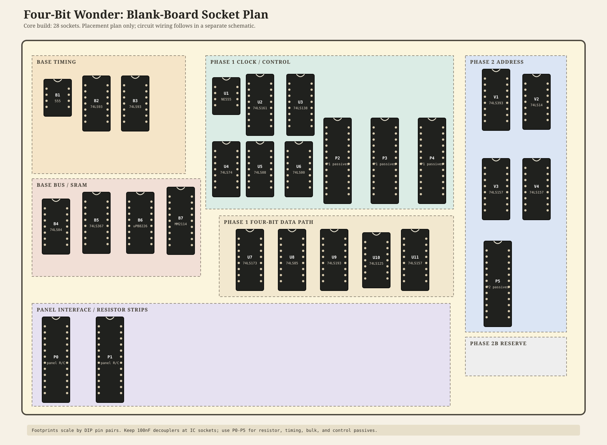

## A Four-Bit Wonder

Repo for technical details on the four-bit wonder machine intelligence system.

_Background_

Invented between the years 2021 and 2024, a protobord called _Boagaphish_ to work-through the [details](http://www.paradoxtechnologies.org/engineering/modelc_new/modelc.html) of what machine intelligence _really_ looks like without all the fanfare and (over) hype - although there is good reason to be enthusiastic.

## Project Summary

This repository follows two deliberate paths from the original Four-Bit Wonder.
The **Machine Memory and Game Version** is the small, reversible original-board
extension: a `74LS85` and red/yellow/green indicators turn SRAM reading into a
visible manual match game. The **Machine Autonomous Version** is the later,
independent new-board conclusion: a full Base + Phase 1 + Phase 2 wire-wrap
machine on a Vector `8016-1` Circbord.

The small comparator build is the exploration step. The autonomous build is
not an incremental modification of the photographed board.

### Polysance Action Brief

The [Machine Memory and Game action brief](action-brief/GAME.md) translates
the small comparator build into a Polysance podcast or educational action. It
provides the talking points and demonstration sequence for showing a person
select an address and a value, then observe whether the stored word is lower,
equal, or higher. Its intention is to communicate legible machine behavior:
memory, comparison, and manual intervention are visible without overstating
the board as an autonomous or learning system. The action brief is a
communication guide; the comparator document remains the technical source for
parts, wiring, and safety checks.

## Build Tracks

The photographed Four-Bit Wonder is a handmade, legible two-part experiment: a 555 plus two
`74LS93` timing-divider section, and a manually addressable `MM2114A` 1K x
4-bit SRAM environment. Six front-panel switches select an exposed address;
four top switches set a four-bit value. The board makes timing, bus transfer,
stored state, and power-on indeterminacy visible rather than hiding them in
software.

| Track | Board relationship | Scope |
| --- | --- | --- |
| Existing Four-Bit Wonder | The original photographed board; retained as a reference machine | Manual SRAM experiment and incremental-addition history. |
| [Machine Memory and Game Version](machine-memory-and-game-version.md) | Small incremental extension to the original board | One `74LS85` and red/yellow/green comparison indicators create a manual memory match game. |
| [Machine Autonomous Version](machine-autonomous-version.md) | Independent progressive build on a new Vector `8016-1` board | Base + Phase 1 + Phase 2 autonomous machine. |

The [Machine Memory and Game Version](machine-memory-and-game-version.md)
is the intended small improvement to the original board. The legacy
[incremental autonomous addition](four-bit-wonder-autonomous-addition.md)
remains documented as a more extensive alternative, but it is not the
implementation plan for the new-board Machine Autonomous Version.

## Machine Autonomous Version

The Machine Autonomous Version is a separate, progressive build on a new
Vector `8016-1` Circbord. It combines the base machine, Phase 1 hill-climber,
and Phase 2 address scanner into one wire-wrap system. It does **not** require
modifying or repurposing the photographed Four-Bit Wonder.

In `AUTO` mode it captures a four-bit target, reads the selected SRAM word,
increments or decrements that word toward the target, writes the revised value
back, and halts on equality. Phase 2 extends this behavior across the exposed
address range.

The new-board panel uses an E-Switch `100SP1T1B1M3QEH` SPDT `ON-NONE-ON`
selector with `MANUAL / DISABLED / AUTO` positions. Its `WRITE` button remains
a manual write control in `MANUAL`; in `AUTO` it becomes `LOAD TARGET / START`.
The lower green LED means `INCREASE`, the lower yellow LED means `DECREASE`,
and the upper red LED means `MATCH / HALT`.

### Socket Plan By Phase

The table below lists the IC sockets used by the base machine and the added
requirements for Phase 1 and Phase 2, plus wire-wrap sockets used to terminate
the base machine's resistor and capacitor wiring. Phase 2B target RAM is
optional and is not included here.

| Stage | IC / use | Qty | Socket |
| --- | --- | ---: | --- |
| Base | `555` | 1 | 8-pin |
| Base | `74LS93` | 2 | 14-pin |
| Base | `DM74LS04N` | 1 | 14-pin |
| Base | `SN74LS367A` | 1 | 16-pin |
| Base | [`uPB8226C`](datasheets/UPB8226C.pdf) | 1 | 16-pin |
| Base | `MM2114A` | 1 | 18-pin |
| Base | Panel switch/LED resistor strips | 2 | 24-pin wire-wrap |
| Phase 1 | `NE555` | 1 | 8-pin |
| Phase 1 | `74LS74` | 1 | 14-pin |
| Phase 1 | `74LS08` | 1 | 14-pin |
| Phase 1 | `74LS00` | 1 | 14-pin |
| Phase 1 | `74LS125` | 1 | 14-pin |
| Phase 1 | `74LS85` | 1 | 16-pin |
| Phase 1 | `74LS173` | 1 | 16-pin |
| Phase 1 | `74LS193` | 1 | 16-pin |
| Phase 1 | `74LS161` | 1 | 16-pin |
| Phase 1 | `74LS138` | 1 | 16-pin |
| Phase 1 | `74LS157` | 1 | 16-pin |
| Phase 1 | NE555 timing resistors and capacitor | 1 | 8-pin wire-wrap |
| Phase 1 | LED-driver resistors and pull-downs | 1 | 16-pin wire-wrap |
| Phase 1 | Mode-input and write-button passives | 1 | 16-pin wire-wrap |
| Phase 2 | `74LS14` | 1 | 14-pin |
| Phase 2 | `74LS393` | 1 | 16-pin |
| Phase 2 | `74LS157` | 2 | 16-pin |
| Phase 2 | Counter reset and advance-button passives | 1 | 14-pin wire-wrap |

| Stage | Total sockets | Breakdown |
| --- | ---: | --- |
| Base | 9 | `1 x 8-pin`, `3 x 14-pin`, `2 x 16-pin`, `1 x 18-pin`, `2 x 24-pin wire-wrap` |
| Phase 1 | 14 | `2 x 8-pin`, `4 x 14-pin`, `8 x 16-pin` |
| Phase 2 | 5 | `2 x 14-pin`, `3 x 16-pin` |
| Base + Phase 1 + Phase 2 | 28 | `3 x 8-pin`, `9 x 14-pin`, `13 x 16-pin`, `1 x 18-pin`, `2 x 24-pin wire-wrap` |

The new-board base includes two 24-pin wire-wrap sockets for switch and LED
resistors. They are included in the base total above, not added expansion
requirements. There are 12 opposing pin pairs per socket, providing room for
the 20-resistor panel baseline before timing, decoupling, and other circuit
passives are added:

| Panel use | Qty | Value |
| --- | ---: | --- |
| Six address switches and four data switches | 10 | `22k` pull-down resistor per switch |
| Ten front-panel LEDs | 10 | `330 ohm` current-limit resistor per LED |

The 20-resistor panel baseline fits on the two base strips, leaving four paired
positions spare. For the additions, use the small local wire-wrap
sockets shown in the layout: `P2` holds the NE555 timing network, `P3` the LED
driver parts, `P4` the mode/button parts, and `P5` the Phase 2 reset/button
parts. `P2` has its own local `555 R/C` zone beside the autonomous clock. Keep
bulk capacitors at the power rail and `100nF` decouplers directly
at their IC supply pins rather than allocating passive-strip positions.

### Power And Bring-Up Hardware

The 28-socket total above covers DIP and wire-wrap sockets. A replacement board
also needs these dedicated footprints and service points:

| Qty | Reference | Part / placement | Purpose |
| ---: | --- | --- | --- |
| 1 | `PS1` | USB power bank, regulated 5 V output | External primary supply and its integral over-current protection. |
| 1 | `L1` | Repurposed USB-A lead, two HP5004A signature-analyzer clip leads | Delivers USB `VBUS` and ground to the board. |
| 2 | `J0` | Vector `T46-3-9/C` wire-wrap terminals at the power-entry pair | Clip-lead landing points for `+5V` and ground. |
| 1 set | `PH1` | Black 3D-printed switch/bezel holders ([FreeCAD/STL design pack](designs/README.md)) | Aligns and mounts the new-board panel switches and bezel LEDs. |
| 3 | `Q1`-`Q3` | 3-pin TO-92 wire-wrap or terminal positions beside `P3` | LED low-side drivers. |
| 22 | `C1`-`C22` | `100nF` ceramic, one at every core IC socket | Local supply decoupling for seven base, 11 Phase 1, and four Phase 2 ICs. |
| 1 | `C23` | `47uF` to `100uF` at the `J0` power entry | Input bulk energy storage. |
| 2 | `C24`, `C25` | `10uF` to `47uF` near the Phase 1 and Phase 2 rail sections | Local bulk support. |
| 6 | `TP1`-`TP6` | Single-pin test loops, turrets, or headers | `CLK`, `RST`, `D0-D3`, `/CS`, `/WE`, and `ADDR`. |

The selected replacement-board substrate is the Vector `8016-1` Circbord
(`155 x 155 mm`), listed in the [Phase 1 BOM](phase-one-bom.md).

The holder set can be printed from the available [FreeCAD and STL design
pack](designs/README.md): two `4-bit-switcher` modules plus one each of
`switches-indicator-four`, `led-indicator-2pb-switch`, `led-indicator-four`,
and `led-indicator-three`. Reuse these established switch and bezel modules;
adapt only their carrier placement and attachment to the Vector board.

Do not fit the stocked [`MF-R050-AP`](datasheets/mf-r050-ap.pdf) to this build.
Its `0.50 A` hold current, thermal derating, and up-to-`0.77 ohm` initial
resistance have not been shown to preserve the required TTL rail voltage under
the completed board's worst-case load. The USB power bank remains the primary
current-limited source. Revisit a board-level fuse only after measuring the
fully populated load and selecting a part with verified current and voltage-drop
margin.

Wire `L1`'s USB `VBUS` conductor to the `J0 +5V` terminal with red AWG28
Jonard wire-wrap wire, and USB ground to the `J0 GND` terminal with black
AWG28 wire. The two HP5004A clip leads attach exactly as shown in
[`images/hp-clip-leads.jpg`](images/hp-clip-leads.jpg). Cut back and insulate
the USB data conductors; do not connect them to the board. Confirm polarity
and a `4.75 V` to `5.25 V` rail at `J0` before installing any ICs.

Use the available AWG28 wire-wrap colors consistently:

| Color | Assignment |
| --- | --- |
| Red | `+5V` only |
| Black | Ground only |
| Blue | Four-bit data bus and SRAM data connections |
| Yellow | Clocks, reset, enables, and other timing/control signals |
| White | Other point-to-point logic signals |
| Green (Belden) | LED-drive and panel-indication signals |

### Pushbutton Contact Convention

The new-board `WRITE` button and optional Phase 2 `NEXT ADDRESS` button use
the same stocked pushbutton: **normally closed, open on press**. Wire each
contact between its logic input and ground, with a `10k` pull-up and `100nF`
capacitor from that input to ground. The released contact holds the input low;
pressing opens it so the pull-up takes it high. A `74LS14` then produces the
active-low press event used by the controller. No normally-open replacement
pushbuttons are required.

See [the Machine Autonomous Version](machine-autonomous-version.md) for the
current operating scope, [the Phase 1 BOM](phase-one-bom.md) for the first
autonomous build, and [the Phase 2 BOM](phase-two-bom.md) for the address-scan
expansion. The [incremental autonomous addition](four-bit-wonder-autonomous-addition.md)
is retained only as a legacy original-board alternative.

## Blank-Board Layout

The Phase 1 and Phase 2 BOMs reconcile to this required core board. No
20-pin socket is required: the Phase 1 BOM's generic 20-pin recommendation is
not used by any listed IC.

| Socket | Base | Phase 1 | Phase 2 | Core total |
| --- | ---: | ---: | ---: | ---: |
| 8-pin | 1 | 2 | 0 | 3 |
| 14-pin | 3 | 4 | 2 | 9 |
| 16-pin | 2 | 8 | 3 | 13 |
| 18-pin | 1 | 0 | 0 | 1 |
| 24-pin wire-wrap | 2 | 0 | 0 | 2 |
| **All sockets** | **9** | **14** | **5** | **28** |

If the optional Phase 2B per-address target memory is wanted, reserve another
`1 x 14-pin`, `7 x 16-pin`, and `3 x 24-pin` sockets. The third passive strip
leaves room beyond Phase 2B's 16 pull-ups and eight decoupling capacitors. Also
reserve `1 x 16-pin` socket if the optional `74LS123` pulse shaper is fitted.
That makes a fully provisioned blank board 40 sockets: `3 x 8-pin`, `10 x
14-pin`, `21 x 16-pin`, `1 x 18-pin`, and `5 x 24-pin wire-wrap`.

Place the parts by the signals they share, not by phase. Keep the panel-facing
parts along the lower edge, the SRAM interface together in the centre, and the
clock/control logic away from the data bus.

Regenerate this visual with `python3 scripts/generate_circuital_layout_diagrams.py`.
It is a component-placement plan only; electrical connections and final pin
assignments belong in the later circuit diagram. It includes conceptual grid
and rail positions, pin-1 marks, panel headers, test-point locations, and
ghost footprints for the optional Phase 2B expansion. The Phase 1 control area
also includes an explicit reserve for spare gates or an optional `74LS123`.

Orient every DIP notch toward the top edge. Keep `74LS125` immediately beside
the `74LS193` and `MM2114A`; keep `74LS173` and `74LS85` beside that same
four-bit cluster. Put each `100nF` decoupling capacitor directly across its
IC socket's supply pins, rather than consuming a passive-strip position. Leave
at least two clear perfboard rows between socket bodies for wire-wrap access,
and run separate `+5V` and ground rails down both long board edges.

## Phase 2: Autonomous Address Scanning

Phase 2 extends the single-address hill climber into a 64-address autonomous
sweep. A `74LS393` provides the six automatic address bits, while two
`74LS157` multiplexers select either those bits or the manual front-panel
address switches. The counter advances only after the current address reaches
its target, retaining manual operation in `MANUAL` mode.

Phase 2B is the optional independent-target expansion: four `74LS189AN` RAMs
hold one four-bit target for each address. A `74LS139`, two `74LS153`s, and a
`74LS04` select and restore the target value before it reaches the comparator.
See [the Phase 2 BOM](phase-two-bom.md) for the finalized component allocation
and implementation notes.
