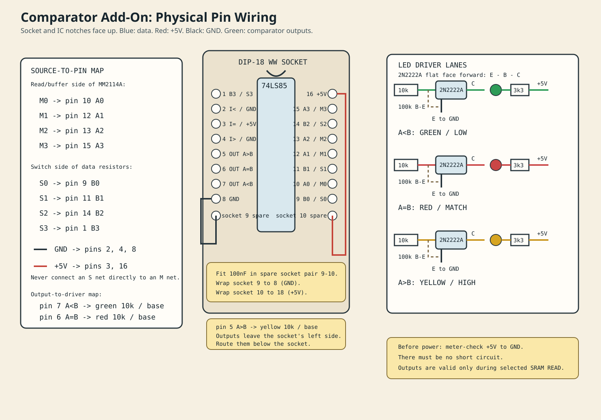

## Comparator Stage Build Guide

1. **Gather parts.**  
   Use one `74LS85`, 18-pin socket, 100nF ceramic capacitor, three LEDs (red/yellow/green), three stocked `2N2222A` TO-92 transistors, three `10k` base resistors, three `100k` base-to-emitter resistors, and three `3.3k` LED resistors. With the flat face toward you and leads down, each stocked transistor is `emitter - base - collector`.

I imagined the comparator add-on as a **socketed wire-wrap subassembly**, not permanently soldered passives:

- `74LS85`: one 18-pin DIP wire-wrap socket. Align the IC notch with the socket notch, placing the 16-pin IC in socket contacts `1` through `8` and `11` through `18`; contacts `9` and `10` remain unused by the IC.
- `100nF` comparator decoupler: fit its leads into the unused opposing socket contacts `9` and `10`. On the wire-wrap side, connect contact `9` to contact `8` (`GND`) and contact `10` to contact `18` (`+5V`, carrying `74LS85` pin `16`). The spare contacts are isolated, so both short wrap links are required.
- Three `2N2222A`: three 3-pin TO-92 wire-wrap positions, made from small machined-pin socket strips or individual wire-wrap terminals. This lets you replace a transistor and accommodate its actual lead order.
- Add one 16-pin wire-wrap passive socket near the comparator for the three `10k` base resistors and the three optional `100k` base-emitter pull-downs. Six of its eight opposing pairs are used.
- Add one 8-pin wire-wrap passive socket for the three `3.3k` LED current-limit resistors. The fourth opposing pair remains available as a spare.
- LEDs: retain them in the panel/bezel holders; connect their leads to two nearby wire-wrap terminals or a two-pin machined socket position so the panel can be disconnected for service.

So the physical addition is: one `DIP-18` comparator socket with its local decoupler, one `DIP-16` passive strip, one `DIP-8` passive strip, and three TO-92 socket positions. Leave both existing `DIP-24` passive strips allocated to the base machine. That keeps every replaceable part socketed while keeping the decoupler at the comparator socket.

2. **Power down the Four-Bit Wonder.**  
   Fit the `DIP-18` comparator socket above the `MM2114A` RAM, vertically aligned with it. Keep its notch facing the same direction as the RAM notch and leave enough clearance to remove the RAM. Do not insert the `74LS85` yet. This placement keeps the `M0-M3` read-data runs short; keep the local `+5V`, `GND`, and `100nF` decoupler connections short as well.

3. **Identify and label the existing signals.**  
   Trace, meter-check, and label:
   - `S0-S3`: switch side of the four data-switch series resistors.
   - `M0-M3`: SRAM/buffer side of those resistors, the MM2114 read-data bus.
   - `+5V` and `GND`.  
   `S0`/`M0` are least significant; `S3`/`M3` are most significant.

4. **Wire comparator power and decoupling.**  
   Connect `74LS85` pin `16` (socket contact `18`) to `+5V` using red wire and pin `8` (socket contact `8`) to ground using black wire. Fit the `100nF` capacitor in spare contacts `9` and `10`, then make the short wire-wrap links `9` to `8` and `10` to `18`.

5. **Set the cascade inputs for one standalone comparator.**  
   Connect pin `2` (`A<B` cascade input) to ground, pin `3` (`A=B` cascade input) to `+5V`, and pin `4` (`A>B` cascade input) to ground.

6. **Wire the SRAM read word to the A inputs.**  
   Use blue wire:
   - pin `10` `A0` to `M0`
   - pin `12` `A1` to `M1`
   - pin `13` `A2` to `M2`
   - pin `15` `A3` to `M3`

7. **Wire the switch-selected target to the B inputs.**  
   Use blue wire:
   - pin `9` `B0` to `S0`
   - pin `11` `B1` to `S1`
   - pin `14` `B2` to `S2`
   - pin `1` `B3` to `S3`  
   Keep the A inputs on the SRAM/buffer side and B inputs on the switch side. Never join both comparator sides to the SRAM bus.

8. **Build the three LED driver stages.**  
   For each NPN transistor: emitter to ground; `100k` from base to emitter; LED cathode to collector; LED anode through `3.3k` to `+5V`. Verify the transistor lead order from its datasheet.

9. **Connect comparator outputs to the drivers.**  
   Use green wire through a separate `10k` resistor to each transistor base:
   - pin `7` `A<B` to the green `LOW / INCREASE` LED
   - pin `6` `A=B` to the red `MATCH` LED
   - pin `5` `A>B` to the yellow `HIGH / DECREASE` LED

10. **Inspect before inserting the IC.**  
    Check for no short between `+5V` and ground, correct capacitor polarity-independent placement, transistor pinout, and no accidental connection between `S0-S3` and `M0-M3`.

11. **Power and test.**  
    Insert the `74LS85`, set the SRAM to selected/read mode (`/CS` asserted, `/WE` high), choose an address, then vary the four data switches. One LED should be active:
    - green: stored word is lower than switch word
    - red: values match
    - yellow: stored word is higher than switch word

The comparator result is invalid during SRAM writes or when the SRAM is deselected. The full reference remains in [comparator-version.md](/home/cartheur/ame/aiventure/aiventure-github/cartheur/four-bit-wonder/comparator-version.md).
